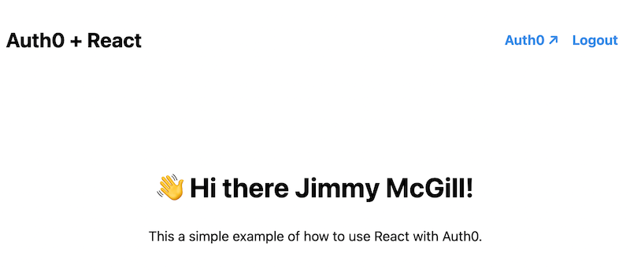

## Auth0 example using React

This application demonstrates using Auth0 in a React application. Once the user logs in using the Auth0 login form, the application will display their name:



## Usage

You need to have an [Auth0 application](https://auth0.com/docs/get-started/applications) created to run this example. All the configuration URLs like the callback URL should point to `https://localhost`. Make sure that the application is configured to be a single-page application or you'll run into mysterious errors! Once you have created the application, expose its details to [Vite](https://vitejs.dev/) through environment variables using an `.env` file:

```conf
VITE_AUTH0_DOMAIN=yourveryowndomain.auth0.com
VITE_CLIENT_ID=client-id-from-auth-0
```

Install the dependencies and start the development server:

```bash
# Install dependencies
npm ci

# Start development server
npm run dev

...

# Proxy https://localhost to http://localhost:5173 using CAddy
caddy reverse-proxy --from localhost:443 --to localhost:5173
```

Now if you navigate to `https://localhost`, you should see a view instructing you to log in. Use the link to log in to Auth0, enter your user credentials and Auth0 will then redirect you to the application callback. The application will then use the access code from the callback request to grab tokens from Auth0, which will be used to get your profile information.
