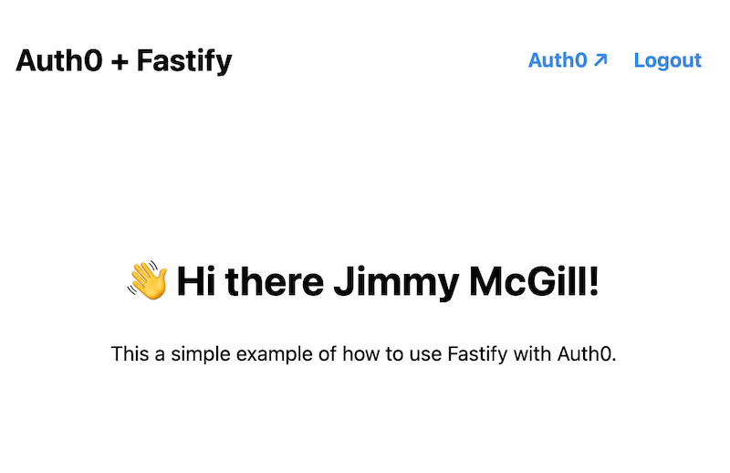

## Auth0 example using Fastify

This application demonstrates using Auth0 [Authorization Code Flow with PKCE](https://auth0.com/docs/get-started/authentication-and-authorization-flow/authorization-code-flow-with-proof-key-for-code-exchange-pkce) in a [Fastify](https://www.fastify.io/) application. Once the user logs in using the Auth0 login form, the application will display their name:



Note that you should [first take a look at the official Auth0 library](https://github.com/auth0/express-openid-connect) at least for Express apps. However, this project may help you understand just what is happening behind the scenes.

## Usage

Install the dependencies first:

```
npm ci
```

You need to have an [Auth0 application](https://auth0.com/docs/get-started/applications) created to run this example. Once you have one, expose its details to the application through environment variables using an `.env` file for example:

```
SESSION_SECRET=some-secret-used-to-encrypt-sessions
AUTH0_DOMAIN=yourveryowndomain.auth0.com
CLIENT_ID=client-id-from-auth-0
CLIENT_SECRET=client-secret-from-auth-0
```

You can also override other properties [described in the config](./src/config.ts) like the callback URL if you wish. However, if you don't, the callback URL will default to `https://localhost/callback` and the logout URL will default to `https://localhost/logout`. Verify that your Auth0 application settings use these same URLs or the OAuth flow will not work!

Auth0 recommends using HTTPS even for local development. The easiest way to do this is to install [Caddy](https://caddyserver.com/) and use it as a local reverse proxy in front of the actual application:

```bash
# Reverse proxy https://localhost to http://localhost:3000
caddy reverse-proxy --from localhost:443 --to localhost:3000

...

# Start the app in development mode
npm run dev
```

Now if you navigate to `https://localhost`, you should see a view instructing you to log in. Use the link to log in to Auth0, enter your user credentials and Auth0 will then redirect you to the application callback. The application will then use the access code from the callback request to grab tokens from Auth0, which will be used to get your profile information.
